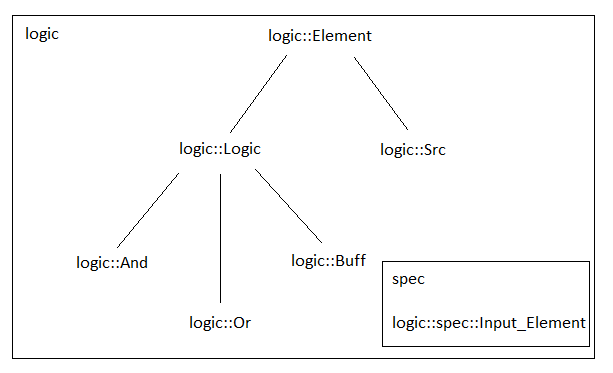
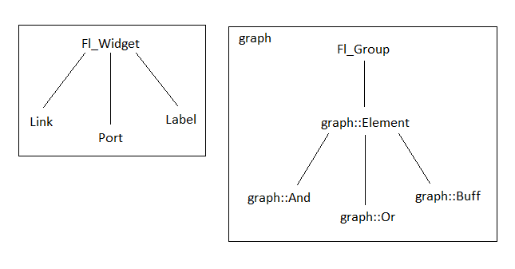
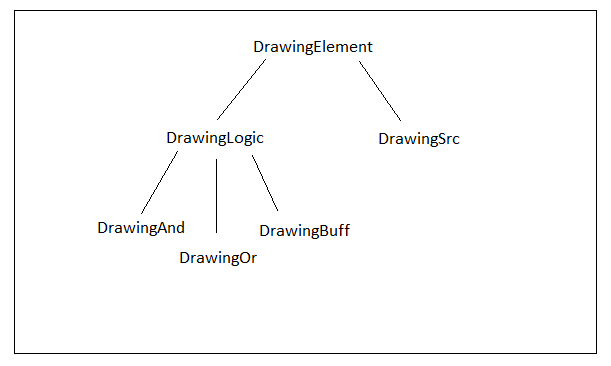

#Инженерный практикум

##Формулировка задачи:
Наша задача состоит в том, чтобы создать программу, в которой пользователь может создавать свои логические схемы с помощью элементов. Всё это происходит в оконном приложении, в котором он может создавать элементы, связывать их с другими и тд.

##Анализ задачи:

...

##Идеи:

Конечно же, как и в любом другом проекте, в голову приходит много интересных идей, которые хочется реализовать.

Одна из таких первых заключается в том, чтобы пользователь мог сохранять файл, в котором содержатся логические элементы. Ведь если человек долго строил схемы и после упорной работы захотел отдохнуть и выключить компьютер, то все его изменения пропадут, как только он закроет программу. Поэтому мы решили, чтобы пользователь имел возможность сохранять все свои изменения, чтобы на следующий день продолжить работать над этим же файлом.
Вторая идея состоит в том, чтобы пользователь мог отслеживать значения в ходе разработки своей схемы. Так, например, при значении 1 будет гореть зеленый кружок, при значение 0 будет гореть красный, а если значение не определено - синий.

Третья идея заключается в том, что количество входящих элементов в нашей программе будет ограничиваться лишь размерами окна.

Плюс ко всему, пользователь может удалить из поля не только элементы, но и связи между ними.

Также мы подумали над тем, что пользователь может зациклить схему. Мы решили оставить такую возможность и не вызывать исключение, потому что они действительно интересны, и по нашему мнению, пользователю тоже будет интересно посмотреть, как будет выглядеть такая схема. Так, например, с помощью зацикленного алгоритма можно создать триггеры, счетчики, осциллятор. Но, к сожалению, мы не успели сделать возможность создания осциллятора.

Логические элементы не закончиваются только на логическом и, или, не. Также существуют или-не, и-не. Мы не стали создать их отдельно, а добавили возможность инвертировать выход логического элемента. Мы не забыли и про исключающее-или и исключающее-и, но мы не стали их реализовывать из-за того, что мы создали базис, с помощью которого можно создать данные элементы.

#Проектирование

#Создание и редактирование классов
Для начала, мы начали с разработки классов логических элементов. Они находятся в пространстве имен logic, создан базовый класс logic::Element, от которого наследованы logic::Src и logic::Logic. logic::Src - это логический элемент, который не имеет входящих элементов и всегда имеет какое-то значение (1 или 0). По сути, это ресурс, с которого начинается логическая схема. logic::Logic - это элементы, которые имеют входящие элементы. От этого класса унаследованы такие классы, как logic::And, logic::Or, logic::Buff. Из названий понятно, какие функции они выполняют. Также было создано пространство имен spec, которое содержит класс Input_Element - это логические элементы, входящие в какой-то элемент. Поэтому logic::Logic содержит в себе вектор из Input_Element.

Далее мы начали создавать классы, отвечающие за графику. Мы начали с окна, на котором и будут размещаться элементы. Был создан класс LogicWindow, на котором как раз и размещается всё, что есть в нашей программе. Он содержит LogicMap* map, Fl_Menu_Bar* menu_bar, Fl_Box* map_box, Fl_Box* elems_box, Fl_Scroll* elems. LogicMap - наследник класса Fl_Sсroll, содержит логические элементы. Именно на map будут строиться логические схемы. menu_bar - строка меню. Она содержит на данный момент только кнопку "File", где можно открывать, сохранять и удалять файл. elems - кнопки, с помощью которых на поле map можно создавать логические элементы. А map_box и elems_box отвечают лишь за оконтовку. Также мы создали классы CreateButton, ElemList и MapGroup. ElemList содержит в себе CreateButton, которые в свою очередь содержат кнопки. Эти кнопки и создают логические элементы. MapGroup нужен для того

Также мы отдельно создали классы для отрисовки самих логических элементов. Их мы поместили в пространстве имен graph. LinkCircle - класс, отрисовывающий кружки. Link - класс, который рисует линии. Эти линии и показывают нам, как связаны между собой логические элементы. Label - класс, который содержит фигуру логического элемента. Element - базовый класс, хранящий Link, Port и Label. От него наследуются And, Or, Buff и тд, которые как раз таки рисуют наши элементы.

Ну и дополнительно был создан базовый класс DrawingElement, для удобной работы с файлом при чтении и записи.

#Сложности, которые возникли в процессе проектирования и реализации

Самой сложной задачей заключалась в том, чтобы связать между собой графику и логику. 